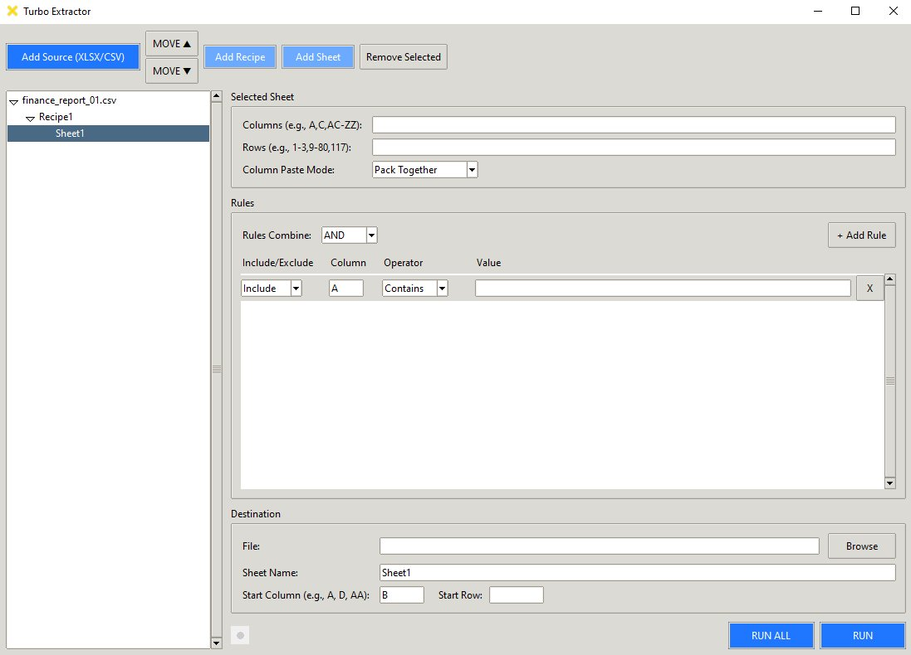
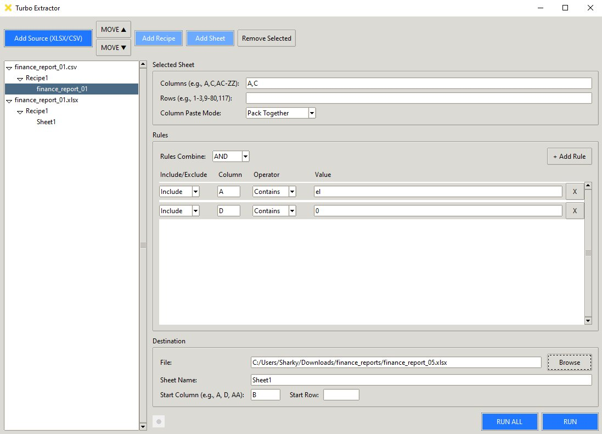
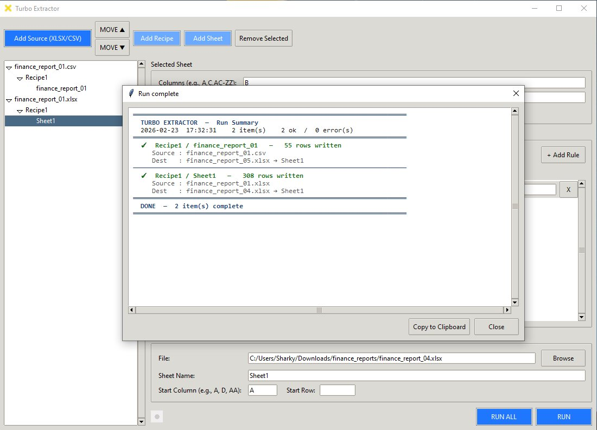

# Turbo Extractor

A desktop GUI tool for extracting, filtering, and reorganizing data from Excel (`.xlsx`) and CSV files. Built with Python and Tkinter.

Turbo Extractor lets you pull specific columns and rows from one or more source files, apply include/exclude rules, and write the results to a destination workbook — all without writing code or formulas. It's designed for people who regularly wrangle spreadsheet data and want a faster, repeatable workflow.



---

## Features

**Source handling** — Load multiple `.xlsx` and `.csv` files. Each source can contain multiple recipes, and each recipe can target different sheets within the source.

**Column and row selection** — Pick columns by letter (`A,C,E-G,AA-AZ`) and rows by number (`1-3,9-80,117`). Leave blank to grab everything.

**Rules-based filtering** — Add include or exclude rules on any column using equals, contains, `<`, or `>` operators. Combine rules with AND/OR logic. Rules reference absolute source columns so they work regardless of which columns you're extracting.



**Two paste modes:**
- **Pack Together** — selected columns are packed side by side with no gaps
- **Keep Format** — preserves the relative spacing between selected columns

**Destination control** — Choose the output file, sheet name, and starting column/row. When start row is left blank, data appends after existing content automatically.

**Batch execution** — Run All processes every sheet item across every source in one click. Results are summarized in a color-coded report dialog.



**Templates** — Save a sheet's configuration as a reusable JSON template. Set a default template that auto-applies to every new source you add.

**Autosave** — Your project state is saved automatically to `~/.turbo_extractor_v3/autosave.json` with atomic writes, so nothing is lost if the app closes unexpectedly.

---

## Installation

### From source

Requires **Python 3.10+** and Tkinter (included with most Python installations).

```bash
git clone https://github.com/YOUR_USERNAME/turbo-extractor.git
cd turbo-extractor
pip install -r requirements.txt
python main.py
```

### Windows installer

A standalone `.exe` installer is available on the [Releases](https://github.com/YOUR_USERNAME/turbo-extractor/releases) page. No Python installation required.

---

## Usage

1. Click **Add Source** to load one or more `.xlsx` or `.csv` files.
2. Select a sheet in the tree on the left — the editor panel on the right shows its settings.
3. Enter the columns and rows you want to extract. Add rules to filter rows by cell values.
4. Set the destination file, sheet name, and starting position.
5. Click **Run** to process the selected item, or **Run All** to process everything.

**Tips:**
- Right-click a recipe or sheet in the tree to rename it or manage templates.
- Use **Move ▲ / Move ▼** to reorder sources, recipes, and sheets.
- Hover over any field label for a tooltip explaining what it does.

---

## Project Structure

```
turbo-extractor/
├── main.py                  # Entry point
├── core/                    # Pipeline logic (no GUI dependency)
│   ├── engine.py            # Public API / re-export shim
│   ├── runner.py            # Single-item extraction pipeline
│   ├── batch.py             # Batch orchestrator
│   ├── reader.py            # XLSX/CSV reading
│   ├── writer.py            # XLSX writing
│   ├── planner.py           # Column/row planning
│   ├── landing.py           # Destination collision detection
│   ├── shaper.py            # Pack/Keep column layout
│   ├── rules.py             # Row filtering engine
│   ├── models.py            # Data classes (SheetConfig, etc.)
│   ├── parser.py            # Column/row spec parsing
│   ├── autosave.py          # Atomic JSON autosave
│   ├── template_store.py    # Template save/load/default
│   └── errors.py            # Structured error codes
├── gui/                     # Tkinter interface
│   ├── app.py               # Application bootstrap
│   ├── main_window.py       # Main window class
│   ├── ui_build.py          # Widget layout and tooltips
│   ├── tooltip.py           # Hover tooltip module
│   └── mixins/              # Focused GUI behaviors
│       ├── tree_mixin.py
│       ├── editor_mixin.py
│       ├── report_mixin.py
│       └── throbber_mixin.py
├── tests/                   # 370+ tests
│   ├── test_parser.py
│   ├── test_rules.py
│   ├── test_shaper.py
│   ├── test_runner.py
│   ├── test_batch.py
│   ├── test_edge_gaps.py
│   └── ...
├── requirements.txt
├── CHANGELOG.md
└── LICENSE
```

---

## Running Tests

```bash
pytest
```

All 370+ tests run without any external files or network access.

---

## Tech Stack

- **Python 3.10+**
- **Tkinter** — GUI framework (ships with Python)
- **openpyxl** — Excel read/write
- **pytest** — test framework

---

## License

[MIT](LICENSE)
